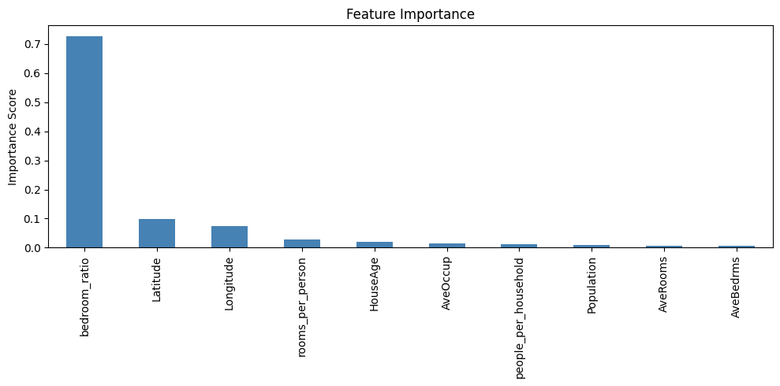
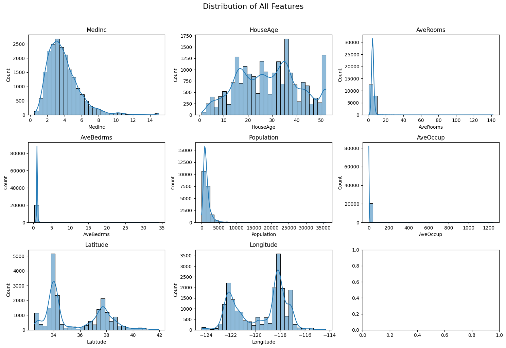
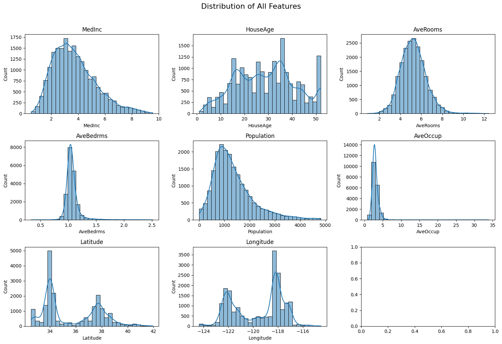

# 🏠 California Housing Price Prediction

> A complete end-to-end Machine Learning pipeline to predict **Median Income** of California housing blocks using the classic California Housing dataset.

---

## 📌 Problem Statement

Housing affordability and income distribution are critical factors in real estate analysis and urban planning. This project builds a regression model to **predict the median income (`MedInc`) of a California housing block** based on housing and demographic features.

Accurately predicting median income helps:
- Real estate platforms estimate neighborhood value
- Urban planners identify income disparity across regions
- Financial institutions assess loan risk in geographic areas

---

## 📂 Dataset Description

**Source:** `sklearn.datasets.fetch_california_housing` (derived from the 1990 U.S. Census)

**Size:** 20,640 rows × 8 features

| Feature | Description |
|---------|-------------|
| `MedInc` | Median income of households in the block *(Target Variable)* |
| `HouseAge` | Median age of houses in the block |
| `AveRooms` | Average number of rooms per household |
| `AveBedrms` | Average number of bedrooms per household |
| `Population` | Total population of the block |
| `AveOccup` | Average number of occupants per household |
| `Latitude` | Latitude coordinate of the block |
| `Longitude` | Longitude coordinate of the block |

**Data Quality:**
- No missing values
- No duplicate rows
- Several features with significant right skew (AveRooms skew: 20.7, AveBedrms skew: 31.3, AveOccup skew: 97.6)

---

## 🔍 Approach

The project follows a structured ML pipeline:

```
Data Loading → EDA → Outlier Removal → Feature Engineering → Train/Test Split → Scaling → Modelling → Tuning → Evaluation
```

### 1. Exploratory Data Analysis (EDA)
- Plotted distribution of all features using histograms with KDE curves
- Analyzed skewness of each feature — most features are right-skewed
- Checked correlation of features to target variable `MedInc`
- Key finding: `AveRooms` had the highest raw correlation to `MedInc` (0.63)

### 2. Outlier Removal
Removed rows where any feature value was beyond 3 standard deviations using Z-score filtering:
```python
from scipy import stats
df = df[(np.absolute(stats.zscore(df)) < 3).all(axis=1)]
```
Dataset reduced from **20,640 → 19,794 rows** after outlier removal.

### 3. Feature Engineering
Three new features were engineered to boost predictive signal:

| New Feature | Formula | Intuition |
|-------------|---------|-----------|
| `rooms_per_person` | `AveRooms / AveOccup` | Spaciousness per occupant — wealthier areas have more space |
| `bedroom_ratio` | `AveBedrms / AveRooms` | Proportion of bedrooms — lower ratio indicates higher-end homes |
| `people_per_household` | `Population / AveOccup` | Household density — higher density often signals lower income |

### 4. Train/Test Split
```python
X_train, X_test, y_train, y_test = train_test_split(x, y, test_size=0.3, random_state=42)
# Training set: 13,855 rows (70%)
# Test set:      5,939 rows (30%)
```

### 5. Feature Scaling
Applied `StandardScaler` — fit on training data only to prevent data leakage:
```python
scaler = StandardScaler()
X_train_scaled = pd.DataFrame(scaler.fit_transform(X_train), columns=x.columns)
X_test_scaled = pd.DataFrame(scaler.transform(X_test), columns=x.columns)
```

---

## 🤖 Model Comparison

Three models were trained and evaluated on the same test set:

| Model | R² | RMSE | MAE |
|-------|-----|------|-----|
| Linear Regression | 0.6866 | 0.8964 | 0.6819 |
| Gradient Boosting | 0.7856 | 0.7415 | 0.5529 |
| **Random Forest** | **0.8007** | **0.7149** | **0.5262** |

### Why Random Forest Won
- Achieved the **highest R² (0.80)** — explains 80% of income variance
- **Lowest RMSE and MAE** — predictions closest to actual values
- Handles non-linear relationships that Linear Regression cannot capture
- More stable than Gradient Boosting without requiring heavy tuning
- Gradient Boosting underperformed Random Forest at default settings — it needs more tuning to reach its potential

---

## ⚙️ Hyperparameter Tuning

Used `RandomizedSearchCV` with 5-fold cross-validation to find optimal parameters:

```python
param_grid = {
    'n_estimators': [100, 200, 300],
    'max_depth': [None, 10, 20, 30],
    'min_samples_split': [2, 5, 10],
    'min_samples_leaf': [1, 2, 4]
}
```

**Best parameters found:**
```
n_estimators: 300
max_depth: 30
min_samples_split: 5
min_samples_leaf: 2
Best CV R²: 0.8004
```

**Overfitting detected** with these parameters:
```
Train R²: 0.9562 | Test R²: 0.8021 | Gap: 0.1541 ⚠️
```

**Fix — simplified model to reduce overfitting:**
```python
better_model = RandomForestRegressor(
    n_estimators=300,
    max_depth=10,
    min_samples_split=10,
    min_samples_leaf=4,
    random_state=42
)
```

---

## 📊 Results

### Final Model Performance

| Metric | Before Tuning | After Overfitting Fix |
|--------|--------------|----------------------|
| Train R² | 0.9562 | 0.8582 |
| Test R² | 0.8021 | 0.7876 |
| Gap | 0.1541 ⚠️ | 0.0706 ✅ |

The gap reduced from **0.15 → 0.07**, indicating the model now generalizes significantly better to unseen data — a small trade-off in test accuracy for much better reliability.

### Feature Importance



| Feature | Importance | Insight |
|---------|-----------|---------|
| `bedroom_ratio` | 0.72 | Dominant predictor — bedroom proportion strongly signals income level |
| `Latitude` | 0.10 | Location is key — Northern vs Southern California income differences |
| `Longitude` | 0.07 | East-West geography also matters |
| `rooms_per_person` | 0.03 | Spaciousness mildly correlates with income |

> **Key finding:** The engineered feature `bedroom_ratio` became the most important predictor at 72% importance — outperforming all original features. This validates the feature engineering step.

### Distribution of Features (Before Outlier Removal)


### Distribution of Features (After Outlier Removal)


---

## 🛠️ Tech Stack

| Tool | Purpose |
|------|---------|
| Python 3 | Core language |
| Pandas | Data manipulation |
| NumPy | Numerical operations |
| Matplotlib / Seaborn | Visualizations |
| Scikit-learn | ML models, preprocessing, evaluation |
| SciPy | Outlier detection (Z-score) |
| Joblib | Model serialization |

---

## 🚀 How to Run

```bash
# 1. Clone the repository
git clone https://github.com/yourusername/california-housing-prediction.git
cd california-housing-prediction

# 2. Install dependencies
pip install pandas numpy matplotlib seaborn scikit-learn scipy joblib

# 3. Run the notebook
jupyter notebook Untitled7.ipynb
```

---

## 💾 Saved Artifacts

```
best_model.pkl   ← trained Random Forest model
scaler.pkl       ← fitted StandardScaler for preprocessing new data
```

**To load and use the saved model:**
```python
import joblib
model = joblib.load('best_model.pkl')
scaler = joblib.load('scaler.pkl')

# Predict on new data
new_data_scaled = scaler.transform(new_data)
predictions = model.predict(new_data_scaled)
```

---

## 📈 Key Takeaways

- Feature engineering was the **biggest performance driver** — `bedroom_ratio` alone explained 72% of model decisions
- Random Forest outperformed both Linear Regression (+11% R²) and Gradient Boosting
- Overfitting was detected and corrected by constraining tree complexity
- Location features (Latitude/Longitude) are the second most important signal after engineered features

---

## 🔮 Future Improvements

- Apply log transformation to highly skewed features (AveOccup, AveRooms)
- Tune Gradient Boosting — it has potential to outperform Random Forest with proper tuning
- Try XGBoost or LightGBM for faster and potentially more accurate results
- Add geospatial visualizations (income heatmap across California)
- Build a simple prediction API with Flask or FastAPI

---

## 👤 Author

Built as a complete end-to-end ML project covering EDA, feature engineering, model selection, hyperparameter tuning, and overfitting detection.
