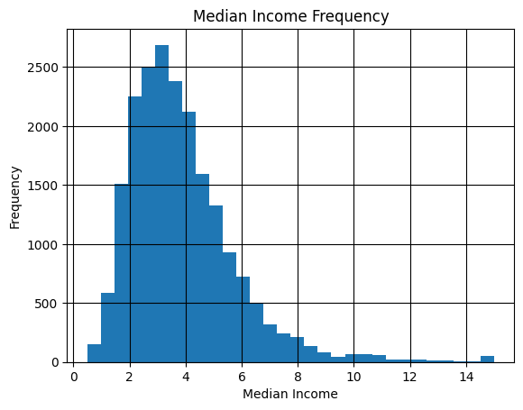
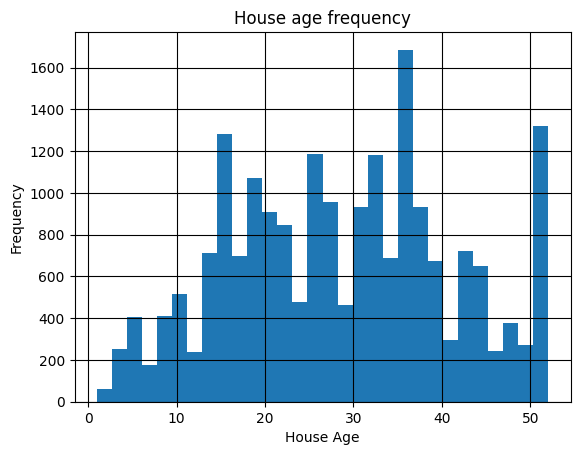
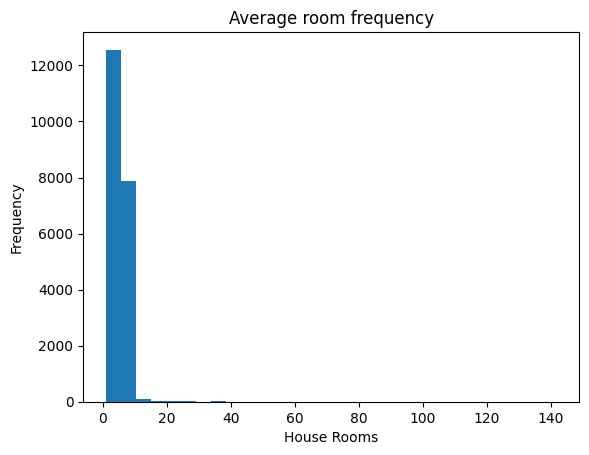
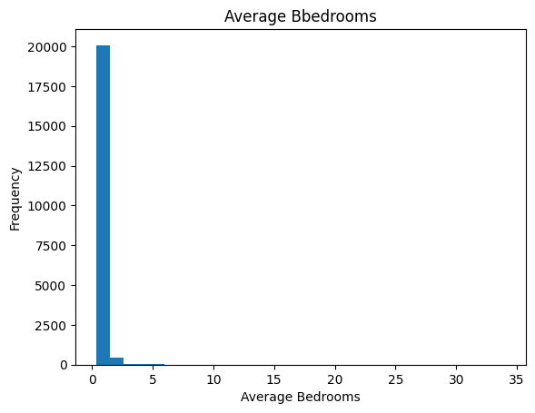
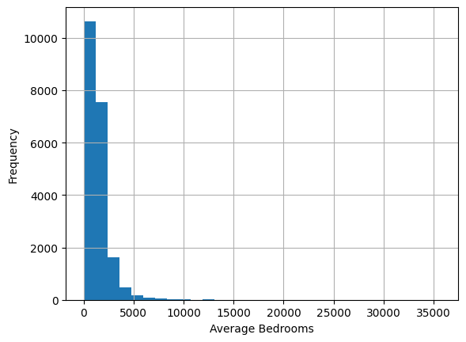
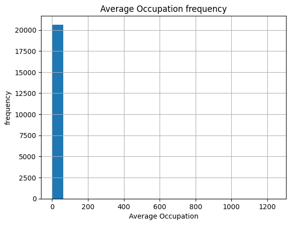
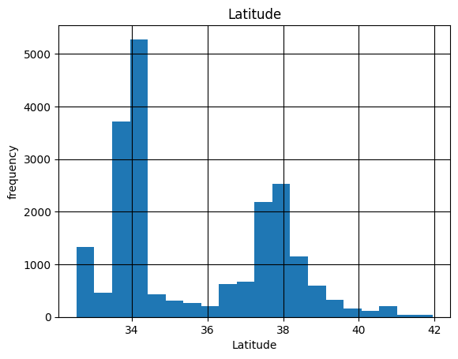
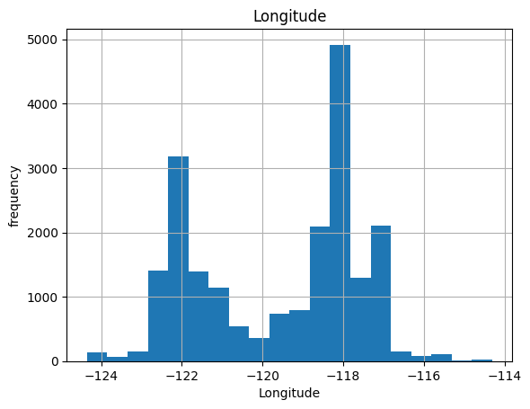

```python
# 1. importing the datasets


import matplotlib.pyplot as plt
import pandas as pd
import numpy as np
from sklearn.datasets import fetch_california_housing
dataset = fetch_california_housing()
print(dataset.data)

```

    [[   8.3252       41.            6.98412698 ...    2.55555556
        37.88       -122.23      ]
     [   8.3014       21.            6.23813708 ...    2.10984183
        37.86       -122.22      ]
     [   7.2574       52.            8.28813559 ...    2.80225989
        37.85       -122.24      ]
     ...
     [   1.7          17.            5.20554273 ...    2.3256351
        39.43       -121.22      ]
     [   1.8672       18.            5.32951289 ...    2.12320917
        39.43       -121.32      ]
     [   2.3886       16.            5.25471698 ...    2.61698113
        39.37       -121.24      ]]
    


```python
# changing it to pandas dataframe

df = pd.DataFrame(dataset.data, columns = dataset.feature_names)
print(df.shape)   # 20,640 rows and 8 columns 
print(dataset.feature_names)
```

    (20640, 8)
    ['MedInc', 'HouseAge', 'AveRooms', 'AveBedrms', 'Population', 'AveOccup', 'Latitude', 'Longitude']
    


```python
# 2. Data cleaning
```


```python
print(df.describe())
```

                 MedInc      HouseAge      AveRooms     AveBedrms    Population  \
    count  20640.000000  20640.000000  20640.000000  20640.000000  20640.000000   
    mean       3.870671     28.639486      5.429000      1.096675   1425.476744   
    std        1.899822     12.585558      2.474173      0.473911   1132.462122   
    min        0.499900      1.000000      0.846154      0.333333      3.000000   
    25%        2.563400     18.000000      4.440716      1.006079    787.000000   
    50%        3.534800     29.000000      5.229129      1.048780   1166.000000   
    75%        4.743250     37.000000      6.052381      1.099526   1725.000000   
    max       15.000100     52.000000    141.909091     34.066667  35682.000000   
    
               AveOccup      Latitude     Longitude  
    count  20640.000000  20640.000000  20640.000000  
    mean       3.070655     35.631861   -119.569704  
    std       10.386050      2.135952      2.003532  
    min        0.692308     32.540000   -124.350000  
    25%        2.429741     33.930000   -121.800000  
    50%        2.818116     34.260000   -118.490000  
    75%        3.282261     37.710000   -118.010000  
    max     1243.333333     41.950000   -114.310000  
    


```python
df.head(5)
```


<div>
<style scoped>
    .dataframe tbody tr th:only-of-type {
        vertical-align: middle;
    }

    .dataframe tbody tr th {
        vertical-align: top;
    }

    .dataframe thead th {
        text-align: right;
    }
</style>
<table border="1" class="dataframe">
  <thead>
    <tr style="text-align: right;">
      <th></th>
      <th>MedInc</th>
      <th>HouseAge</th>
      <th>AveRooms</th>
      <th>AveBedrms</th>
      <th>Population</th>
      <th>AveOccup</th>
      <th>Latitude</th>
      <th>Longitude</th>
    </tr>
  </thead>
  <tbody>
    <tr>
      <th>0</th>
      <td>8.3252</td>
      <td>41.0</td>
      <td>6.984127</td>
      <td>1.023810</td>
      <td>322.0</td>
      <td>2.555556</td>
      <td>37.88</td>
      <td>-122.23</td>
    </tr>
    <tr>
      <th>1</th>
      <td>8.3014</td>
      <td>21.0</td>
      <td>6.238137</td>
      <td>0.971880</td>
      <td>2401.0</td>
      <td>2.109842</td>
      <td>37.86</td>
      <td>-122.22</td>
    </tr>
    <tr>
      <th>2</th>
      <td>7.2574</td>
      <td>52.0</td>
      <td>8.288136</td>
      <td>1.073446</td>
      <td>496.0</td>
      <td>2.802260</td>
      <td>37.85</td>
      <td>-122.24</td>
    </tr>
    <tr>
      <th>3</th>
      <td>5.6431</td>
      <td>52.0</td>
      <td>5.817352</td>
      <td>1.073059</td>
      <td>558.0</td>
      <td>2.547945</td>
      <td>37.85</td>
      <td>-122.25</td>
    </tr>
    <tr>
      <th>4</th>
      <td>3.8462</td>
      <td>52.0</td>
      <td>6.281853</td>
      <td>1.081081</td>
      <td>565.0</td>
      <td>2.181467</td>
      <td>37.85</td>
      <td>-122.25</td>
    </tr>
  </tbody>
</table>
</div>


```python
#checking missing values
print(df.isna().sum()) 

# checking duplicate values
print("Duplicated count :{}".format(df.duplicated().sum())) 
# 0 duplicate and no missing values
```

    MedInc        0
    HouseAge      0
    AveRooms      0
    AveBedrms     0
    Population    0
    AveOccup      0
    Latitude      0
    Longitude     0
    dtype: int64
    Duplicated count :0
    


```python
# 3. Exploratory Data Analysis (EDA)

plt.hist(df['MedInc'], bins=30)
plt.xlabel("Median Income")
plt.ylabel("Frequency")
plt.title("Median Income Frequency")
plt.grid(color = "black")
plt.show() 
print("the data skewness : {}".format(round(df["MedInc"].skew()),2))
         
```


    

    


    the data skewness : 2
    


```python
print("the skewness is : {}".format(df['HouseAge'].skew()))
plt.hist(df['HouseAge'], bins=30)
plt.xlabel("House Age")
plt.ylabel("Frequency")
plt.title("House age frequency")
plt.grid(color = "black")
plt.show()        
         
```

    the skewness is : 0.06033063759913685
    


    

    


```python
print("the average room skewness id : {}".format(df['AveRooms'].skew()))

plt.hist(df['AveRooms'], bins=30)
plt.xlabel("House Rooms")
plt.ylabel("Frequency")
plt.title("Average room frequency")
plt.show()       
```

    the average room skewness id : 20.69786895671065
    


    

    


```python
print("the skewness of Average Bedrooms: {}".format(df['AveBedrms'].skew()))

plt.hist(df['AveBedrms'], bins=30)
plt.xlabel("Average Bedrooms")
plt.ylabel("Frequency")
plt.title("Average Bbedrooms")
plt.show()        
         
```

    the skewness of Average Bedrooms: 31.316956246782674
    


    

    


```python
print("the skewness of population is :{}".format(df["Population"].skew()))
plt.hist(df['Population'], bins=30)
plt.xlabel("Average Bedrooms")
plt.ylabel("Frequency")
plt.grid()
plt.show()   
```

    the skewness of population is :4.935858226727124
    


    

    


```python
print("theskewness of AveOccup is : {}".format(df["AveOccup"].skew()))
plt.hist(df['AveOccup'], bins =20)
plt.xlabel("Average Occupation")
plt.ylabel("frequency")
plt.title("Average Occupation frequency")
plt.grid()
plt.show
```

    theskewness of AveOccup is : 97.63956096369486
    


    <function matplotlib.pyplot.show(close=None, block=None)>


    

    


```python
print("theskewness of Latitude is : {}".format(df["Latitude"].skew()))
plt.hist(df['Latitude'], bins =20)
plt.xlabel("Latitude")
plt.ylabel("frequency")
plt.title("Latitude")
plt.grid(color = "black")
plt.show()
```

    theskewness of Latitude is : 0.4659530037099799
    


    

    


```python

print("theskewness of Longitude is : {}".format(df["Longitude"].skew()))
plt.hist(df['Longitude'], bins =20)
plt.xlabel("Longitude")
plt.ylabel("frequency")
plt.title("Longitude")
plt.grid()
plt.show
```

    theskewness of Longitude is : -0.2978012079524363
    


    <function matplotlib.pyplot.show(close=None, block=None)>


    

    


```python
import seaborn as sns

fig, axes = plt.subplots(3, 3, figsize=(15, 10))
axes = axes.flatten()

for i, col in enumerate(df.columns):
    sns.histplot(df[col], ax=axes[i], bins=30, kde=True)
    axes[i].set_title(col)

plt.suptitle('Distribution of All Features', fontsize=16, y=1.02)
plt.tight_layout()
plt.show()
```


    

    


```python
# Removing Outliers

from scipy import stats
df = df[(np.absolute(stats.zscore(df)) < 3).all(axis = 1)]
```


```python
import seaborn as sns

fig, axes = plt.subplots(3, 3, figsize=(15, 10))
axes = axes.flatten()

for i, col in enumerate(df.columns):
    sns.histplot(df[col], ax=axes[i], bins=30, kde=True)
    axes[i].set_title(col)

plt.suptitle('Distribution of All Features', fontsize=16, y=1.02)
plt.tight_layout()
plt.show()
```


    

    


```python

```


```python
print(df.corr)
print("the largest columns correlated to MedInc: {}".format(df.corr()["MedInc"].nlargest(4)))
```

    <bound method DataFrame.corr of        MedInc  HouseAge  AveRooms  AveBedrms  Population  AveOccup  Latitude  \
    0      8.3252      41.0  6.984127   1.023810       322.0  2.555556     37.88   
    1      8.3014      21.0  6.238137   0.971880      2401.0  2.109842     37.86   
    2      7.2574      52.0  8.288136   1.073446       496.0  2.802260     37.85   
    3      5.6431      52.0  5.817352   1.073059       558.0  2.547945     37.85   
    4      3.8462      52.0  6.281853   1.081081       565.0  2.181467     37.85   
    ...       ...       ...       ...        ...         ...       ...       ...   
    20635  1.5603      25.0  5.045455   1.133333       845.0  2.560606     39.48   
    20636  2.5568      18.0  6.114035   1.315789       356.0  3.122807     39.49   
    20637  1.7000      17.0  5.205543   1.120092      1007.0  2.325635     39.43   
    20638  1.8672      18.0  5.329513   1.171920       741.0  2.123209     39.43   
    20639  2.3886      16.0  5.254717   1.162264      1387.0  2.616981     39.37   
    
           Longitude  
    0        -122.23  
    1        -122.22  
    2        -122.24  
    3        -122.25  
    4        -122.25  
    ...          ...  
    20635    -121.09  
    20636    -121.21  
    20637    -121.22  
    20638    -121.32  
    20639    -121.24  
    
    [19794 rows x 8 columns]>
    the largest columns correlated to MedInc: MedInc        1.000000
    AveRooms      0.628754
    Population    0.005272
    Longitude    -0.016568
    Name: MedInc, dtype: float64
    


```python

```


```python
# Feature engineeering and data preprocessing 

#Feature Engineering: Adding additional columns to features to boost the signal on target variable
df['rooms_per_person'] = df["AveRooms"] /df["AveOccup"]
df["bedroom_ratio"] = df["AveBedrms"] / df["AveRooms"]
df["people_per_household"] = df["Population"] / df["AveOccup"]

#features splitting
x = df.drop(["MedInc"], axis = 1)
y = df["MedInc"]

from sklearn.model_selection import train_test_split
X_train, X_test, y_train, y_test = train_test_split(x, y, test_size = 0.3, random_state = 42)
print(X_train.shape)
print(X_test.shape)
print(y_train.shape)
print(y_test.shape)
```

    (13855, 10)
    (5939, 10)
    (13855,)
    (5939,)
    


```python
#  Features preprocessing
from sklearn.preprocessing import StandardScaler
scaler = StandardScaler()
X_train_scaled = pd.DataFrame(scaler.fit_transform(X_train), columns = x.columns)
X_test_scaled = pd.DataFrame(scaler.transform(X_test), columns = X_test.columns)
print(X_train_scaled.shape)
print(X_test_scaled.shape)
print(X_train_scaled.describe().round(2))

```

    (13855, 10)
    (5939, 10)
           HouseAge  AveRooms  AveBedrms  Population  AveOccup  Latitude  \
    count  13855.00  13855.00   13855.00    13855.00  13855.00  13855.00   
    mean       0.00     -0.00       0.00       -0.00      0.00      0.00   
    std        1.00      1.00       1.00        1.00      1.00      1.00   
    min       -2.25     -3.60      -5.23       -1.65     -2.58     -1.45   
    25%       -0.80     -0.69      -0.47       -0.68     -0.59     -0.81   
    50%        0.00     -0.05      -0.15       -0.22     -0.13     -0.65   
    75%        0.65      0.60       0.23        0.43      0.42      0.97   
    max        1.85      5.91      10.68        4.28     21.78      2.95   
    
           Longitude  rooms_per_person  bedroom_ratio  people_per_household  
    count   13855.00          13855.00       13855.00              13855.00  
    mean       -0.00              0.00           0.00                  0.00  
    std         1.00              1.00           1.00                  1.00  
    min        -2.37             -3.01          -2.02                 -1.61  
    25%        -1.11             -0.65          -0.66                 -0.66  
    50%         0.53              0.04          -0.18                 -0.22  
    75%         0.79              0.61           0.47                  0.41  
    max         2.52              7.75          13.82                  7.13  
    


```python
# Training the model
from sklearn.linear_model import LinearRegression
from sklearn.ensemble import RandomForestRegressor, GradientBoostingRegressor
from sklearn.metrics import mean_squared_error, mean_absolute_error, r2_score
import numpy as np
models = {
    "LinearRegression": LinearRegression(),
    "Random Forest": RandomForestRegressor(random_state = 42),
    "Gradient Boosting": GradientBoostingRegressor(random_state = 42)
}
for name, model in models.items():
    model.fit(X_train_scaled, y_train)
    y_pred = model.predict(X_test_scaled)
    print(f"\n{name}")
    print(f" R^2 : {r2_score(y_test, y_pred):.4f}")
    print(f" RMSE : {np.sqrt(mean_squared_error(y_test, y_pred)):.4}")
    print(f" MAE : {mean_absolute_error(y_test,y_pred):.4}")
```

    
    LinearRegression
     R^2 : 0.6866
     RMSE : 0.8964
     MAE : 0.6819
    
    Random Forest
     R^2 : 0.8007
     RMSE : 0.7149
     MAE : 0.5262
    
    Gradient Boosting
     R^2 : 0.7856
     RMSE : 0.7415
     MAE : 0.5529
    


```python
from sklearn.model_selection import RandomizedSearchCV

param_grid = {
    'n_estimators': [100, 200, 300],
    'max_depth': [None, 10, 20, 30],
    'min_samples_split': [2, 5, 10],
    'min_samples_leaf': [1, 2, 4]
}

random_search = RandomizedSearchCV(
    RandomForestRegressor(random_state=42),
    param_grid,
    n_iter=20,       # only 20 combinations instead of 144
    cv=5,
    scoring='r2',
    n_jobs=-1,
    verbose=2,
    random_state=42
)

random_search.fit(X_train_scaled, y_train)
print("Best parameters:", random_search.best_params_)
print("Best R²:", random_search.best_score_.round(4))
```

    Fitting 5 folds for each of 20 candidates, totalling 100 fits
    Best parameters: {'n_estimators': 300, 'min_samples_split': 5, 'min_samples_leaf': 2, 'max_depth': 30}
    Best R²: 0.8004
    


```python
best_model = random_search.best_estimator_

train_r2 = best_model.score(X_train_scaled, y_train)
test_r2 = best_model.score(X_test_scaled, y_test)

print(f"Train R²: {train_r2:.4f}")
print(f"Test R²:  {test_r2:.4f}")
print(f"Difference: {train_r2 - test_r2:.4f}")
```

    Train R²: 0.9562
    Test R²:  0.8021
    Difference: 0.1541
    


```python
# Force simpler trees to reduce overfitting
better_model = RandomForestRegressor(
    n_estimators=300,
    max_depth=10,        # reduce from 30 → 10
    min_samples_split=10, # increase from 5 → 10
    min_samples_leaf=4,   # increase from 2 → 4
    random_state=42
)

better_model.fit(X_train_scaled, y_train)

train_r2 = better_model.score(X_train_scaled, y_train)
test_r2 = better_model.score(X_test_scaled, y_test)

print(f"Train R²: {train_r2:.4f}")
print(f"Test R²:  {test_r2:.4f}")
print(f"Difference: {train_r2 - test_r2:.4f}")
```

    Train R²: 0.8582
    Test R²:  0.7876
    Difference: 0.0706
    


```python
feat_importance = pd.Series(
    better_model.feature_importances_,
    index=x.columns
).sort_values(ascending=False)

feat_importance.plot(kind='bar', figsize=(10, 5), color='steelblue')
plt.title("Feature Importance")
plt.ylabel("Importance Score")
plt.tight_layout()
plt.show()
```


    

    


```python
import joblib
joblib.dump(better_model, 'best_model.pkl')
joblib.dump(scaler, 'scaler.pkl')
print("Model saved successfully!")
```

    Model saved successfully!
    


```python

```
